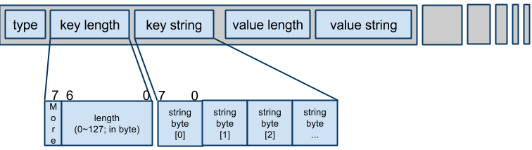

# ChromeOS Vital Product Data (VPD) Binary Blob 2.0

[TOC]

## Overview

The [Chrome OS Platform VPD Reporting Specification](https://docs.google.com/a/google.com/document/d/1d2l5obmBYxgaJQvltEJD-oiLTb0M-RXG-pujG5VDa_A/edit?hl=en#)
describes how a firmware image complies with the Chrome OS SMBIOS requirement.
That document defines the required fields of type 0/1/127 tables and type 241
binary blob pointers. However, the format of type 241 is left for each ODM to
define. In most cases this is acceptable because Google is not involved in
manufacturing and RMA processes.

The type 241 data often consists of component IDs and other items that affect
the OEM software setup. Component IDs include network device IDs, IDs for
removable devices (storage, RAM, etc), and other arbitrary ID types. OEM
software information includes the default country code, language code, and so
on.

Occasionally, modifying the vendor product data is required. Each OEM uses a
proprietary format, which varies from model to model. To minimize variations,
Google defined a standard format for the Vital Product Database (VPD) that is
common, simple, and extensible.

This document describes the standard format for the VPD on Chrome devices. The
format provides:

* An universal vendor product data format for all ODMs and OEMs
* A method for tracking serial numbers for all removable or replaceable
  components on a machine
* A more efficient, usable approach for both manufacturing and Return Materials
  Authorization (RMA) processes

The format design principles were:

* Simple encoding implementation (no XML)
* Flexible enough for different hardware configurations

## **Syntax**

The basic syntax for database entries is `{type, key, value} * n`. Instead of
using a null-terminated ASCII string for key and value, we prefix a length for
binary-safe. The string size varies according to the length value that precedes
it. Every byte is contiguous and back-to-back. Padding the value is field
allowed. To avoid parsing the VPD structure, the hardcoded fixed address can be
used to read VPD values directly.

The following diagram illustrates the structure of the blob:


The entire binary blob is an array of `{key, value}` pairs. At the end, a `0x00`
(`VPD_TYPE_TERMINATOR`) or a `0xFF` (`VPD_TYPE_IMPLICIT_TERMINATOR`) indicates
the end of the array and the binary blob.

The combination of key and value can exceed 127 bytes. Setting the More bit to 1
indicates the next byte has lower significant 7 bits in length.

## **Encoding example**

The following example shows how to encode strings of normal length:

    <01> <04> "UUID"          <10> "0123456789ABCDEF"
    <01> <07> "3G_IMEI"       <0E> "AABBBBBB-CC-DD"
    <01> <0C> "ethernet_mac"  <06> <2A><02><03><B3><D5><7C>
    <00>   // the terminator

The following example shows how to encode longer strings, like "any=Very long
long long...":

    <01> <03> "any"     <84><82><01> "Very long long long"...(65793 bytes)
    <00>

The VPD supports 4 types:

| Type | Name                           | Description                        |
|------|--------------------------------|------------------------------------|
| 0x00 | `VPD_TYPE_TERMINATOR`          | Terminates VPD data.               |
| 0x01 | `VPD_TYPE_STRING`              | Encoded string length-value pair.  |
| 0xFE | `VPD_TYPE_INFO`                | Key-value pair VPD info header.    |
| 0xFF | `VPD_TYPE_IMPLICIT_TERMINATOR` | Same as VPD_TYPE_TERMINATOR.       |

Additional information:

`VPD_TYPE_STRING` is made up of a key pair and a value pair.

`VPD_TYPE_INFO` is a key-value pair the AP Firmware (sometimes referred as BIOS)
uses to parse the VPD. The search pattern is,"`gVpdInfo`",(see `VPD_INFO_MAGIC`
in the code) and the 4-byte size of VPD data follows.

For details of each type, search for `VPD_TYPE_*` in the code.

## **Utility command examples**

Chrome OS includes a utility for manipulating VPD data. The examples below show
how to use the VPD utility to perform common tasks. Each task is described in
the comment line preceding the example:

```sh
  # Dump all key-pairs in RO_VPD partition on the flash
  % vpd -l
    "serial_number"="20100915SKU0015566"
    "SKU"="SKU0001"
    "UUID"="0001-0203_04050607"
    "ethernet_mac"="2A:45:29_66:D4:57"

  # Dump RW_VPD partition
  % vpd -l -i "RW_VPD"

  # Rather using flashrom to access flash (usually slow), access a temp file.
  % flashrom -r vpd.bin
  % vpd -f vpd.bin -l

  # Add a new key-value pair, which value is a string (-s)
  % vpd -f vpd.bin -s "SKU"="0123456789ABCDEF"

  # Assign padding length in value field. -p must be in front of the -s
  # you want to take effected on.
  % vpd -f vpd.bin -p 16 -s "SKU"="0123"
  # In this case, the value of SKU is 16-byte long, which contains 12
  # \0 at tail.

  # Add tons of key-value pairs at one time.
  % vpd -f vpd.bin -p 32 -s "serial_number"="20101214_MARIO_1122" \
                   -p 16 -s "ethernet_mac"="11:22:33:44:55:66" \
                         -s "mlb_serial_number"="2037291738734" \
                   -p 8  -s "UUID"="2323-3524-2344364-133456" \
                   ...

  # By default, utility accesses "RO_VPD" on flash. You can specify -i
  # parameter to access particular partition.
  # PS. -O means overwriting any garbage in partition.
  vpd -i "RW_VPD" -O -s "ActivateDate=2011/03/02 11:22:33"

  # Read a specific key-value pair. Specially useful in shell script.
  % vpd -g "mlb_serial_number"
    MB20100914_012345
  # no key string and no quotes in output.

  # Delete a key-value pair
  % vpd -f vpd.bin -d "3G_IMEI"
```

## Partition names

The AP firmware image for Chrome OS has two VPD partitions. Each stores a
specific type of data:

* `RO_VPD` partition in the read-only area. Stores machine-specific information,
  like the mainboard serial number and MAC address.
* `RW_VPD` partition in the writeable area. Stores all data that will be updated
  after a device leaves the factory.

Note that the naming convention includes the underscore ( _ ) character.

## VPD fields

Although VPD 2.0 doesn't define a fixed data structure, Google requires partners
to include specific VPD fields in the AP firmware image, for example
`serial_number`. The list of VPD fields are available in the ChromeOS Partner
Site document "VPD Field Requirements".

In theory the VPD name can be arbitrary string, but in order to simplify
processing, the utility only accepts names in CamelCase or lower_underline,
i.e., in regular expression `[a-zA-Z0-9_]+`.

## Appendix A

This information is intended for a developer audience.

### Type enumerates used in 'type' field.

| Value | Type                     |
|-------|--------------------------|
| 0x00  | The terminator           |
| 0x01  | String                   |
| 0xFE  | Info header              |
| 0xFF  | The implicit terminator. |

On the flash media, a non-programmed byte is 0xFF. When decoder reads this
type, it should assume no more pairs are present after this byte.

### Values in Binary Blob Pointer (Type 241)

| Offset  | Name                    | Length   | Value                                |
|---------|-------------------------|----------|--------------------------------------|
| 00h     | Type                    | BYTE     | 241                                  |
| 01h     | Length                  | BYTE     | Varies                               |
| 02h     | Handle                  | WORD     | Varies                               |
| 04h     | Structure Major Version | BYTE     | 01h                                  |
| 05h     | Structure Minor Version | BYTE     | 00h                                  |
| 06h     | Blob Vendor             | BYTE     | 1 "Google"                           |
| 07h     | Blob Description        | BYTE     | 2 "VPD 2.0"                          |
| 08h     | Blob Major Version      | BYTE     | 2                                    |
| 09h     | Blob Minor Version      | BYTE     | 0                                    |
| 0Ah     | Blob Variant            | BYTE     | 3 ""                                 |
| 0Bh-0Fh | Reserved                |          |                                      |
| 10h-1Fh | Blob UUID               | 16 BYTES | 0a7c23d3-8a27-4252-99bf-7868a2e26b61 |
| 20h-23h | Offset                  | DWORD    | Varies                               |
| 24h-27h | Size                    | DWORD    | Varies                               |

## Change Log
| Version | Date       | Changes                                               |
|---------|------------|-------------------------------------------------------|
| 0.17    | 2014/02/27 | Added VPD_TYPE_INFO                                   |
| 0.12    | 2011/04/20 | Reorganized content, updated available options        |
| 0.7     | 2011/03/11 | Added VPD partition names and required field          |
| 0.6     | 2011/03/08 | Made small refinement to Binary Blob Pointer values   |
| 0.5     | 2011/03/02 | Added RW VPD example                                  |
| 0.4     | 2010/12/13 | Fixed the command style                               |
| 0.3     | 2010/12/14 | Added the implicit terminator (0xFF)                  |
| 0.2     | 2010/12/08 | Added type field. Allowed padding.                    |
| 0.1     | 2010/09/14 | Draft version.                                        |

